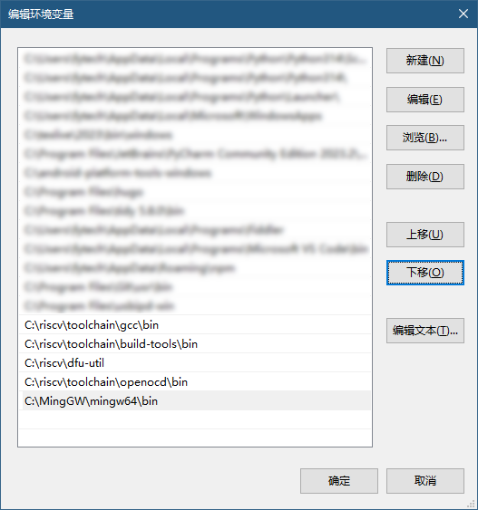
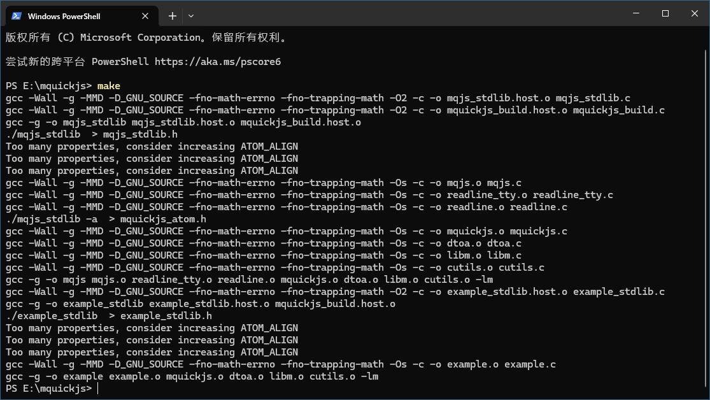
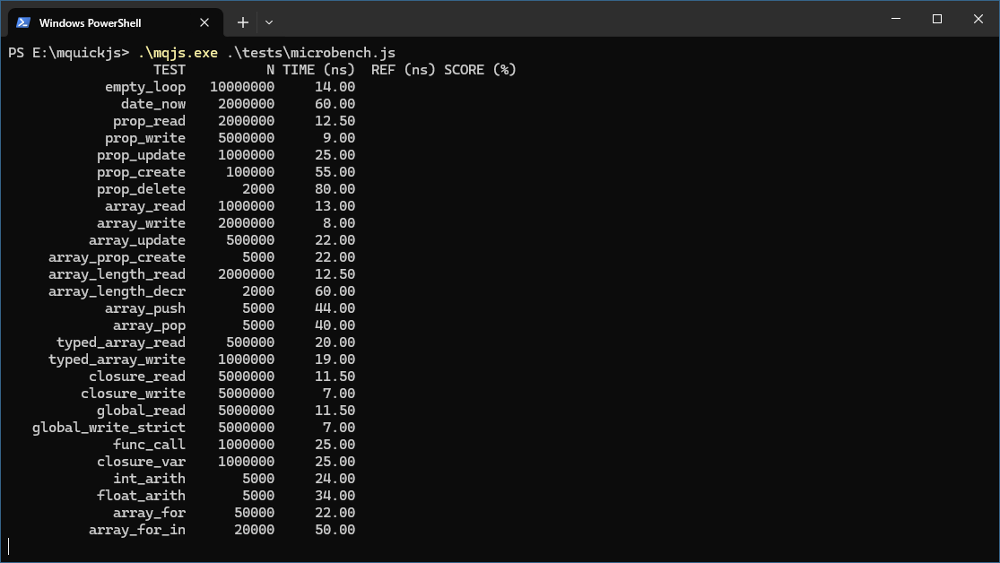
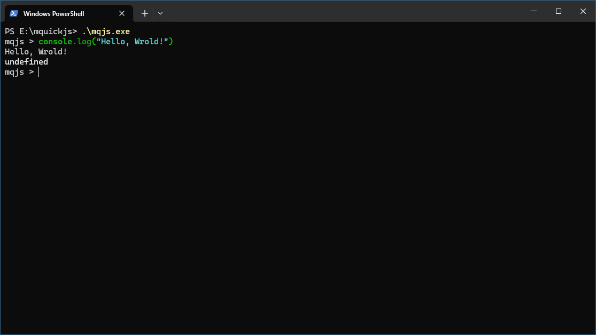
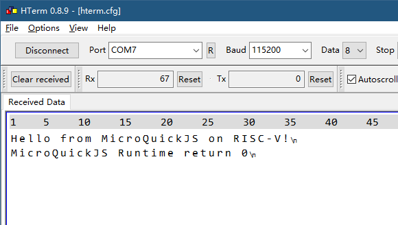
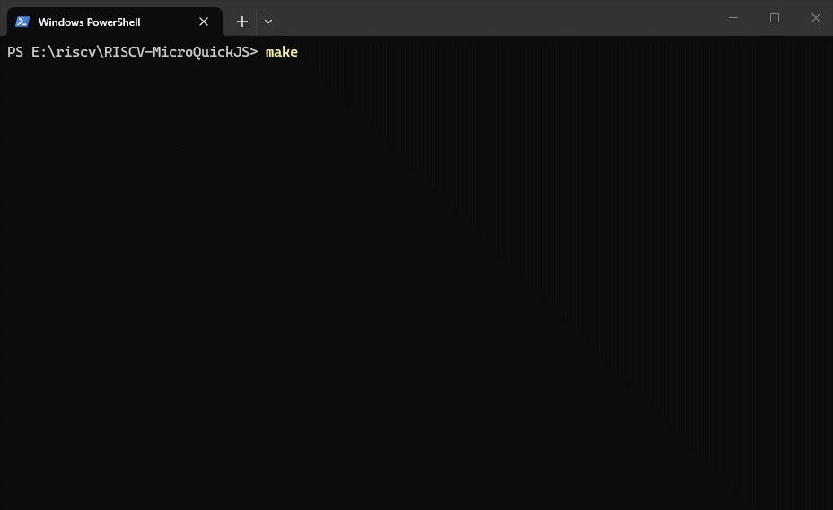
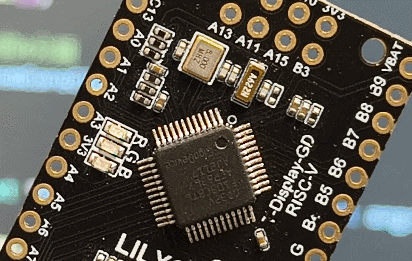
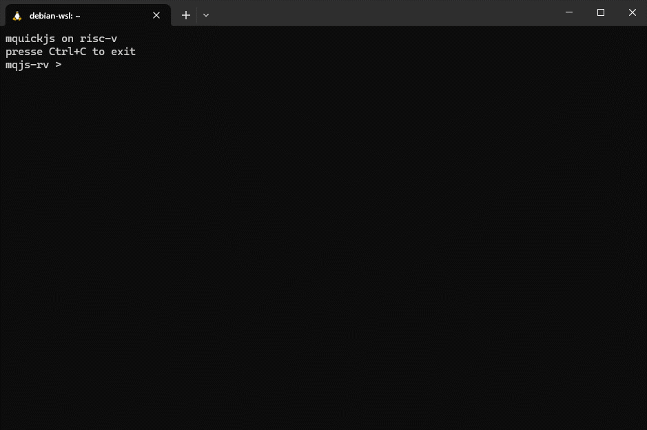

# MicroQuickJS on RISC-V
---

[中文](README.md) | [English](README_en.md)

在 RISC-V MCU 上运行轻量级 JavaScript 运行时 [MicroQuickJS](https://github.com/bellard/mquickjs).

MCU型号为 GD32VF103CBT6, 128K ROM, 32K RAM.

---

## 在PC上编译

**注意: 不管你是否打算在PC上编译, 安装 PC 编译器都是必须的, 因为有两个头文件需要在电脑上生成.**

首先需要安装 MinGW, 从[Winlibs](https://winlibs.com/)下载即可. 我这里下载的是 MinGW-w64 64位, 下载完成后解压, 将bin目录添加到环境变量 PATH 中:



获取mquickjs的源代码, 在源代码目录中打开终端, 输入make编译:



编译完成后目录中的 mqjs.exe 就是 mquickjs 的交互式解释器了, 可以直接执行js文件:



也可以进入REPL直接输入JavaScript代码执行:



MicroQuickJS ROM 需求约100KB(ARM Thumb-2 Code), 考虑到`Thumb-2`比`RISC-V`指令密度更高一些, 而GD32VF103CBT6只有128K flash, 预估只够运行解释器核心及简单的 JavaScript 脚本, 无法支持 REPL 环境.

## MicroQuickJS 源代码结构

MicroQuickJS 源代码包含以下 11 个 C 文件:

```bash
cutils.c 
dota.c
libm.c
mquickjs.c
mqjs.c
mqjs_stdlib.c
example.c
example_stdlib.c
readline.c
readline_tty.c
mquickjs_build.c
```

部分文件功能简单说明如下:

* `mquickjs.c`: 实现解释器核心. 

* `mqjs.c`: 实现 REPL 交互环境, 可运行 JavaScript 脚本, 也可以将 JavaScript 代码编译为字节码供引擎执行. 可以用它在 PC 上将 JavaScript 脚本编译为字节码, 由 MCU 执行字节码.

* `readline.c` 和 `readline_tty.c`: 提供 REPL 的输入处理和语法高亮等特性.

* `example.c` 和 `example_stdlib.c`: 展示如何使用 C API 在 JavaScript 中定义原生对象(如 Rectagle 和 FilledRectagle), 如果需要自定义原生对象, 可参考这两个文件. 

* `mquickjs_build.c`: 用于将 MicroQuickJS 的标准库和自定义对象编译为可存储在ROM的中C结构体, 需要将其与 `*_stdlib.c` 一起编译为本地可执行程序, 执行此程序生成标准库的头文件`*_stdlib.h`（比如`example_stdlib.h`与`mqjs_stdlib.h`） 和 `mquickjs_atom.h`.

生成头文件时根据目标平台选择地址位数参数: 32 位RISC-V MCU 使用 `-m32` 参数, 64 位平台则使用 `-m64` 参数.

示例: 编译 MicroQuickJS 中的 example

***注意: 请在CMD中执行以下命令, PowerShell 中重定向生成的文件编码为UTF-16LE, 可能导致 GCC 编译失败.***

生成头文件的可执行程序, 注意 `example_stdlib.c` 中包含了 `mqjs_stdlib.c` :

```bash
gcc -o example_stdlib.exe example_stdlib.c mquickjs_build.c
```

生成头文件(以 64 位 PC 平台为例):

```bash
example_stdlib.exe -m64 > example_stdlib.h
example_stdlib.exe -m64 -a > mquickjs_atom.h
```

编译 MicroQuickJS 解释器:

```bash
gcc -o example.exe mquickjs.c dtoa.c libm.c cutils.c example.c
```

## 编译到 RISC-V (GD32VF103)

MicroQuickJS编译到其它平台时, 需要实现如下函数:

```c
static JSValue js_print(JSContext *ctx, JSValue *this_val, int argc, JSValue *argv)
static int64_t get_time_ms(void)
static JSValue js_date_now(JSContext *ctx, JSValue *this_val, int argc, JSValue *argv)
static void js_log_func(void *opaque, const void *buf, size_t buf_len)
static JSValue js_performance_now(JSContext *ctx, JSValue *this_val, int argc, JSValue *argv)
static JSValue js_gc(JSContext *ctx, JSValue *this_val, int argc, JSValue *argv)
static JSValue js_load(JSContext *ctx, JSValue *this_val, int argc, JSValue *argv)
static JSValue js_setTimeout(JSContext *ctx, JSValue *this_val, int argc, JSValue *argv)
static JSValue js_clearTimeout(JSContext *ctx, JSValue *this_val, int argc, JSValue *argv)
```

其中 `js_gc`, `js_load`, `js_setTimeout`, `js_clearTimeout` 四个函数不是必须要实现, 如果不实现的话需要将声明从 `mqjs_stdlib.c` 文件中 `js_global_object[]` 数组中删除.

这里选择不更改 `mquickjs/` 中的源代码, 复制 `mqjs_stdlib.c` 到项目根目录, 并在副本中修改.

新建文件 `microquickjs.c`, 参考 `example.c` 和 `mqjs.c` 实现上述函数:

```c
// microquickjs.c
static JSValue js_print(JSContext *ctx, JSValue *this_val, int argc, JSValue *argv)
{
    int i;
    JSValue v;

    for(i = 0; i < argc; i++) {
        if (i != 0)
            putchar(' ');
        v = argv[i];
        if (JS_IsString(ctx, v)) {
            JSCStringBuf buf;
            const char *str;
            size_t len;
            str = JS_ToCStringLen(ctx, &len, v, &buf);
            fwrite(str, 1, len, stdout);
        } else {
            JS_PrintValueF(ctx, argv[i], JS_DUMP_LONG);
        }
    }
    putchar('\n');
    return JS_UNDEFINED;
}

static int64_t get_time_ms(void)
{
    uint64_t tick = get_timer_value();

    return (uint64_t)(tick / (SystemCoreClock / 4000));
}


static JSValue js_date_now(JSContext *ctx, JSValue *this_val, int argc, JSValue *argv)
{
    return JS_NewInt64(ctx, get_time_ms());
}

static JSValue js_performance_now(JSContext *ctx, JSValue *this_val, int argc, JSValue *argv)
{
    return JS_NewInt64(ctx, get_time_ms());
}

static JSValue js_gc(JSContext *ctx, JSValue *this_val, int argc, JSValue *argv)
{
    JS_GC(ctx);
    return JS_UNDEFINED;
}

```

## JavaScript脚本加载

MicroQuickJS 使用如下代码加载并执行脚本:

```c
 int script_len;
 const uint8_t *script = load_file(&script_len);
 val = JS_Eval(ctx, (const char *)script, script_len, "script.js", 0);
```

`load_file()` 函数从文件中读取脚本, 交给引擎执行. 裸机环境无文件系统用, 常见做法是将脚本做为字符串嵌入代码, 但修改脚本不便. 这里选择将脚本文件通过链接器转换为目标文件, 再在 C 代码中引用. 

将`script.js`文件转换为目标文件:

```bash
ld -r -b binary script.js -o script.o
```

或使用 GCC: 

```bash
gcc -r -Wl,-b,binary script.js -o script.o
```

目标文件中会根据如下规则自动生成相关符号:

```bash
_binary_<文件名>_<start|end|size>
```

文件名中的点号`.`, 分割符`-`均会被替换为下划线 `_`, 转换 `script.js` 生成如下符号:

```c
_binary_script_js_start
_binary_script_js_end
_binary_script_js_size
```

在 C 文件中引用:

```c
extern char _binary_script_js_start[];
extern char _binary_script_js_end[];
extern char _binary_script_js_size[];

static const uint8_t *load_file(int *plen)
{
    if (plen)
        *plen = (size_t)_binary_script_js_size;

    return _binary_script_js_start;
}
```

`script.js`文件的内容:

```javascript
(function() {
    console.log('Hello from MicroQuickJS on RISC-V!')
})();
```

运行后串口输出:



## 自定义原生对象

新建 `user_stdlib.c`, 用于注册用户自定义对象, 例如, 定义一个 `LED` 类:

```c
#include "mquickjs_build.h"

// 原型的属性/方法(实例成员)
static const JSPropDef js_led_proto[] = {
    // 第一个参数为属性名称, 第二个参数为 getter, 第三个参数为 setter
    JS_CGETSET_DEF("color", js_led_get_color, NULL),
    JS_CFUNC_DEF("on", 0, js_led_on),
    JS_CFUNC_DEF("off", 0, js_led_off),
    JS_PROP_END,
};

// 类属性/方法(静态成员)
static const JSPropDef js_led[] = {
    // 与上面相同
    JS_PROP_END,
};

static const JSClassDef js_led_class =
    JS_CLASS_DEF("LED", 1, js_led_constructor, JS_CLASS_LED, js_led, js_led_proto, NULL, js_led_finalizer);

#include "mqjs_stdlib.c"
```

注意需要在此文件末尾包含 `mqjs_stdlib.c`.

然后在 `mqjs_stdlib.c` 中将自定义对象添加到全局对象数组:

```c
static const JSPropDef js_global_object[] = {
...
    JS_PROP_CLASS_DEF("LED", &js_led_class),
    JS_PROP_END,
};
...
```

在 JavaScript 脚本即可使用:

```javascript
(function() {
    var led_r = new LED('R')
    console.log(led_r.color)    // "red"
    led_r.on()                  // led on
})()
```

<font color="red">

再次强调, `user_stdlib.c` 并非由交叉编译器编译, 而是与 `mquickjs/mquickjs_build.c` 一起由本地编译器编译为本地可执行程序, 运行此程序生成 `js_stdlib.h`(可自由命名) 和 `mquickjs_atom.h` (名称固定), 供交叉编译器使用.

</font>

防止有人不知道, 这里啰嗦一句: 

**交叉编译器指将代码编译到其它运行环境的编译器, 简单说就是你编译 MCU 程序用的编译器, 你就将它当做 Keil MDK 一类的东西就行.**

**本地编译器就是将代码编译到编译器所处环境运行的编译器, 说人话就是编译 PC 程序的编译器, 编译后得到的程序在电脑上运行, 你当它是`VisualStudio`一类的东西就行.**

对象 `LED` 相关的实现在 `microquickjs.c` 中.

## 编译流程

1. 生成本地可执行程序:

```bash
gcc -o mqjs_stdlib.exe user_stdlib.c mqjs_stdlib.c
```

2. 生成头文件:

```bash
mqjs_stdlib.exe -a -m32 > mquickjs_atom.h
mqjs_stdlib.exe -m32 > js_stdlib.h
```

如果是64位平台, 请使用 `-m64` 参数.

3. 使用交叉编译器正常编译 MCU 工程.

## 使用 makefile 编译

为简化编译流程, 将以上逻辑写入makefile, 输入 `make` 就可以直接编译:



## 使用 softfloat 节省空间

GCC的软浮点实现占用空间比较大, MicroQuickJS自带软浮点实现, 可以使用宏`USE_SOFTFLOAT`启用, 使用 MicroQuickJS 自带的软浮点实现可节省约5KByte空间, 就可以写更长的脚本和实现更多的用户自定义对象了.

## 点个灯

使用自己定义的 `LED` 对象, 可以用 `JavaScript` 控制开发板上的 `LED`:

```javascript
var ledr = new LED('R')
led.on()                // led on
led.color()             // "red"
```

编辑 `script.js`, 输入如下代码:

```javascript
(function() {
    var led = new LED('R')
    var isLedOn = true
    while (true) {
        if (isLedOn)
            led.on()
        else
            led.off()

        var time = Date.now()
        while (Date.now() - time < 1000) {}

        isLedOn = !isLedOn
    }
})();

```

下载程序, 现在就可以看到开发板上的红灯开始闪烁:



## 使用 REPL

MicroQuickJS 使用 `readline.c` 和 `readline_tty.c` 实现了一个自带语法高亮的 REPL, 使用 MicroQuickJS 自带的软件浮点实现后, 节省出超过 5K 的 flash 空间, 这使得加入 REPL 成为可能.

因为 MicroQuickJS 中的 REPL 实现在基于 PC 的, 在嵌入式系统上需要略做修改才能使用. 

`mquickjs/readline_tty.c` 修改的地方太多, 所以在根目录新建 `readline_tty.c`, 重新实现相关接口.

函数 `term_printf()` 和 `term_flush()` 可以直接使用.

在嵌入式系统上, 函数 `readline_tty_init()` 没什么可以初始化的东西, 直接返回列数为`80`即可.

```c
int readline_tty_init(void)
{
    int n_cols = 80;

    // clear screen
    term_printf("\033[2J\033[H");
    term_printf("mquickjs on risc-v\r\n");
    term_printf("presse Ctrl+C to exit\r\n");
    term_flush();

    return n_cols;
}
```

函数 `readline_tty()` 中使用了 posix 函数 `read()`, 因为嵌入式系统主要是从串口读数据, 所以需要重新实现read(), 鉴于 read() 函数在这里也是阻塞式读取, 就干脆轮询从串口读数据, 包装一下做为 `read()` 就可以了.

接下来在 `microquickjs.c` 中实现 `eval_buf()`, `term_get_color()` 等必要函数. 基本上这些函数可以照抄 `mquickjs/mqjs.c` 中的代码, 在此就不多说了. 

修改完成后编译下载, 使用 PuTTY 或类似工具连接串口(注意必须使用TTY工具, 使用串口助手连接得到的将是类似乱码的的东西), 我这里使用的是 WSL, 命令是 screen /dev/ttyS7 115200, 现在就可以使用 REPL 了:



**注意因为初始化的时候返回的列数为80, 所以必须保证TTY窗口的宽度为80列, 否则输入超过80个字符后会出现显示混乱的情况**

按两次 `Ctrl+C` 可以退出 REPL, 这里选择退出 REPL 后执行之前的 JavaScript 脚本文件.

目前仓库有3个分支, `repl` 分支增加 `repl` 实现, `master` 分支停留在增加 `repl` 之前, `dev` 分支与 `repl` 相同.
